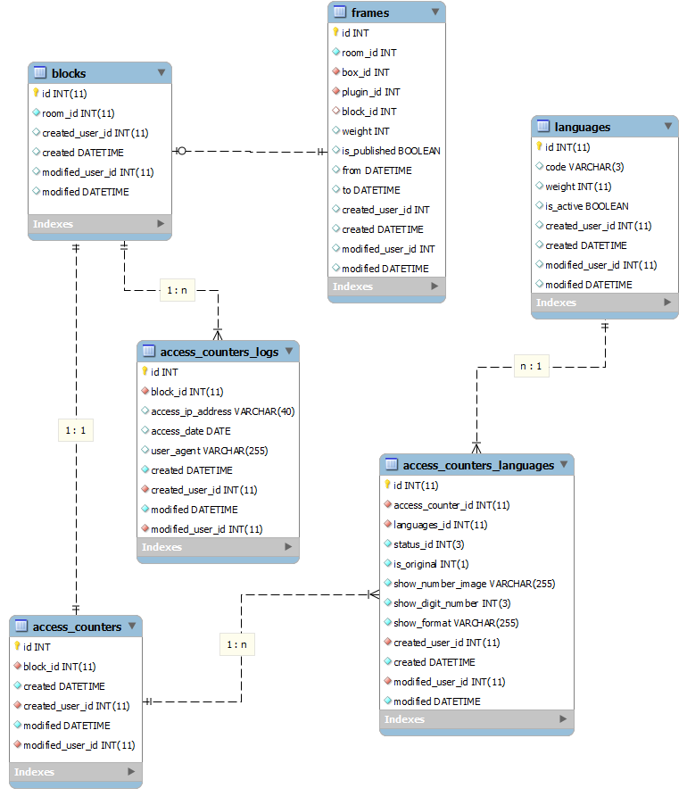

############################
アクセスカウンタープラグイン
############################

.. contents:: 目次
   :local:

*****************************
1. 機能とパート、ロールの関係
*****************************

*****************************
2. 画面
*****************************

=============================
2-1. セッティングモードOFF
=============================

=============================
2-2. セッティングモードON
=============================

-----------------------------
2-2-1. 通常画面
-----------------------------

^^^^^^^^^^^^^^^^^^^^^^^^^^^^^
2-2-1-1. 編集権限あり
^^^^^^^^^^^^^^^^^^^^^^^^^^^^^

^^^^^^^^^^^^^^^^^^^^^^^^^^^^^^^^^^^^^^^^
2-2-1-2. 公開権限あり：公開申請中の場合
^^^^^^^^^^^^^^^^^^^^^^^^^^^^^^^^^^^^^^^^

-----------------------------
2-2-2. 編集画面
-----------------------------

^^^^^^^^^^^^^^^^^^^^^^^^^^^^^
2-2-2-1. 編集中
^^^^^^^^^^^^^^^^^^^^^^^^^^^^^

^^^^^^^^^^^^^^^^^^^^^^^^^^^^^
2-2-2-2. プレビュー中
^^^^^^^^^^^^^^^^^^^^^^^^^^^^^

-----------------------------
2-2-3. ブロックセッティング
-----------------------------

*****************************
3. ERD
*****************************

* frames , blocks, rooms, languages, usersは共通テーブルのため省略

=============================
3-1. データ構成
=============================

--------------------------------------------
3-1-1. access_counters : アクセスカウンター
--------------------------------------------

^^^^^^^^^^^^^^^^^^^^^^^^^^^^^
3-1-1-1. テーブル
^^^^^^^^^^^^^^^^^^^^^^^^^^^^^
+-----------------------+------------------------------------+------------------------------------------------+
| カラム                | タイプ                             | 内容                                           |
+=======================+====================================+================================================+
| id                    | int(11) NOT NULL AUTO_INCREMENT    | PRIMARY                                        |
+-----------------------+------------------------------------+------------------------------------------------+
| block_id              | int(11) NOT NULL                   | ブロックID blocks.id                           |
+-----------------------+------------------------------------+------------------------------------------------+
| created               | datetime NOT NULL                  | 作成日時                                       |
+-----------------------+------------------------------------+------------------------------------------------+
| create_user_id        | int(11) NOT NULL DEFAULT '0'       | 作成者 users.id                                |
+-----------------------+------------------------------------+------------------------------------------------+
| modified              | datetime NOT NULL                  | 更新日時                                       |
+-----------------------+------------------------------------+------------------------------------------------+
| modified_user_id      | int(11) NOT NULL DEFAULT '0'       | 更新者 users.id                                |
+-----------------------+------------------------------------+------------------------------------------------+

^^^^^^^^^^^^^^^^^^^^^^^^^^^^^
3-1-1-2. インデックス
^^^^^^^^^^^^^^^^^^^^^^^^^^^^^
+-----------------------------------------------+-----------------------+-----------------------+
| インデックス                                  | タイプ                | カラム                |
+===============================================+=======================+=======================+
| PRIMARY                                       | PRIMARY               | id                    |
+-----------------------------------------------+-----------------------+-----------------------+

----------------------------------------------------------
3-1-2. access_counters_languages : アクセスカウンター言語
----------------------------------------------------------

^^^^^^^^^^^^^^^^^^^^^^^^^^^^^
3-1-2-1. テーブル
^^^^^^^^^^^^^^^^^^^^^^^^^^^^^
+-----------------------+------------------------------------+------------------------------------------------+
| カラム                | タイプ                             | 内容                                           |
+=======================+====================================+================================================+
| id                    | int(11) NOT NULL AUTO_INCREMENT    | PRIMARY                                        |
+-----------------------+------------------------------------+------------------------------------------------+
| access_counter_id     | int(11) NOT NULL                   | アクセスカウンターID access_counters.id        |
+-----------------------+------------------------------------+------------------------------------------------+
| language_id           | int(11) NOT NULL DEFAULT '1'       | 言語ID languages.id                            |
+-----------------------+------------------------------------+------------------------------------------------+
| status_id             | int(3) NOT NULL DEFAULT '1'        | 状態(記事タイプ)                               |
|                       |                                    |  * 1: 公開(Publish)                            |
|                       |                                    |  * 2: 公開申請(PublishRequest)                 |
|                       |                                    |  * 3: 下書き(Draft)                            |
|                       |                                    |  * 4: 差し戻し/取り下げ(Reject)                |
+-----------------------+------------------------------------+------------------------------------------------+
| is_original           | int(1) NOT NULL DEFAULT '1'        | オリジナル    1: オリジナル   0: 翻訳          |
+-----------------------+------------------------------------+------------------------------------------------+
| show_number_image     | varchar(255) NOT NULL              | 数字画像イメージ                               |
+-----------------------+------------------------------------+------------------------------------------------+
| show_digit_number     | int(3) NOT NULL DEFAULT '1'        | 表示桁数                                       |
+-----------------------+------------------------------------+------------------------------------------------+
| show_format           | varchar(255) NOT NULL              | フォーマット                                   |
+-----------------------+------------------------------------+------------------------------------------------+
| created               | datetime NOT NULL                  | 作成日時                                       |
+-----------------------+------------------------------------+------------------------------------------------+
| create_user_id        | int(11) NOT NULL DEFAULT '0'       | 作成者 users.id                                |
+-----------------------+------------------------------------+------------------------------------------------+
| modified              | datetime NOT NULL                  | 更新日時                                       |
+-----------------------+------------------------------------+------------------------------------------------+
| modified_user_id      | int(11) NOT NULL DEFAULT '0'       | 更新者 users.id                                |
+-----------------------+------------------------------------+------------------------------------------------+

^^^^^^^^^^^^^^^^^^^^^^^^^^^^^
3-1-2-2. インデックス
^^^^^^^^^^^^^^^^^^^^^^^^^^^^^
+-----------------------------------------------+-----------------------+-----------------------+
| インデックス                                  | タイプ                | カラム                |
+===============================================+=======================+=======================+
| PRIMARY                                       | PRIMARY               | id                    |
+-----------------------------------------------+-----------------------+-----------------------+

----------------------------------------------------
3-1-3. access_counters_logs : アクセスカウンターログ
----------------------------------------------------

^^^^^^^^^^^^^^^^^^^^^^^^^^^^^
3-1-3-1. テーブル
^^^^^^^^^^^^^^^^^^^^^^^^^^^^^
+-----------------------+------------------------------------+------------------------------------------------+
| カラム                | タイプ                             | 内容                                           |
+=======================+====================================+================================================+
| id                    | int(11) NOT NULL AUTO_INCREMENT    | PRIMARY                                        |
+-----------------------+------------------------------------+------------------------------------------------+
| block_id              | int(11) NOT NULL                   | ブロックID blocks.id                           |
+-----------------------+------------------------------------+------------------------------------------------+
| language_id           | int(11) NOT NULL DEFAULT '1'       | 言語ID languages.id                            |
+-----------------------+------------------------------------+------------------------------------------------+
| access_ip_address     | varchar(40) NOT NULL               | アクセス元のIPアドレス                         |
+-----------------------+------------------------------------+------------------------------------------------+
| access_date           | date NOT NULL                      | アクセス日                                     |
+-----------------------+------------------------------------+------------------------------------------------+
| user_agent            | varchar(255) NOT NULL              | ユーザエージェント                             |
+-----------------------+------------------------------------+------------------------------------------------+
| created               | datetime NOT NULL                  | 作成日時                                       |
+-----------------------+------------------------------------+------------------------------------------------+
| create_user_id        | int(11) NOT NULL DEFAULT '0'       | 作成者 users.id                                |
+-----------------------+------------------------------------+------------------------------------------------+
| modified              | datetime NOT NULL                  | 更新日時                                       |
+-----------------------+------------------------------------+------------------------------------------------+
| modified_user_id      | int(11) NOT NULL DEFAULT '0'       | 更新者 users.id                                |
+-----------------------+------------------------------------+------------------------------------------------+

^^^^^^^^^^^^^^^^^^^^^^^^^^^^^
3-1-3-2. インデックス
^^^^^^^^^^^^^^^^^^^^^^^^^^^^^
+-----------------------------------------------+-----------------------+-----------------------+
| インデックス                                  | タイプ                | カラム                |
+===============================================+=======================+=======================+
| PRIMARY                                       | PRIMARY               | id                    |
+-----------------------------------------------+-----------------------+-----------------------+
| idx_access_counters_logs1_accesslog           | KEY                   | block_id,             |
|                                               |                       | access_ip_address,    |
|                                               |                       | access_date           |
+-----------------------------------------------+-----------------------+-----------------------+

=============================
3-2. 連携図
=============================

*****************************
4. 機能
*****************************
